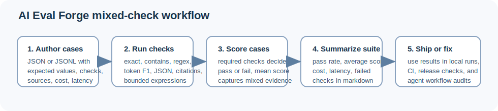

# AI Eval Forge: Mixed-Check Regression Testing for LLM and Agent Workflows

Mukunda Rao Katta

## Abstract

Large-model and agent teams often need faster regression checks than broad benchmark suites can provide. This paper presents AI Eval Forge, a zero-dependency evaluation harness for mixed-check regression testing across LLM and agent workflows. The tool supports exact-match, substring, regex, token-F1, JSON validity, JSON field equality, citation coverage, and bounded custom-expression checks in a compact case format that works with JSON or JSONL. The contribution is not a new benchmark. It is a small, inspectable evaluation layer that helps teams compare runs, catch regressions, and summarize pass rate, score, cost, and latency without standing up a heavy evaluation stack. The paper describes the harness design, check model, reporting format, and practical role of mixed-check cases in real workflow testing.

## 1. Introduction

Evaluation for language-model systems often splits into two extremes. At one end, teams rely on broad benchmark suites that are useful for comparison and research framing, but can feel far from the day-to-day work of checking whether a workflow regressed after a prompt change, parser update, or model swap. At the other end, teams rely on ad hoc spot checks, manual review, and a vague sense that the current output "looks right."

AI Eval Forge sits between those extremes. It is a compact regression harness for LLM and agent systems that lets a team define cases in a lightweight format and score them with mixed checks. The goal is not to replace benchmark programs such as HELM or BIG-bench [@liang2023helm; @srivastava2023beyond], nor agent-oriented suites such as AgentBench or GAIA [@liu2023agentbench; @mialon2023gaia]. The goal is to provide a smaller evaluation layer that is easy to run, inspect, and evolve inside active software work.

This problem matters because modern LLM and agent workflows fail in more than one way. A run can fail by returning the wrong text. It can also fail by violating a structure contract, omitting required evidence, skipping citations, drifting semantically away from the intended answer, or producing the right text for the wrong reasons. A single metric is rarely enough to describe that range cleanly.

The core contribution of this paper is a software-and-method description of mixed-check regression testing. AI Eval Forge combines several small evaluation checks in one case format and returns both case-level and suite-level summaries. That design supports faster iteration on practical workflows while keeping the evaluation logic visible to the people shipping the system.

## 2. Why Small Eval Harnesses Still Matter

Even when a team has access to larger evaluation infrastructure, there are several reasons to keep a compact harness around.

First, local workflow tests need to be cheap to run and easy to edit. A developer changing an output schema or a retrieval prompt often wants feedback in minutes, not after a larger offline evaluation cycle.

Second, many workflows need heterogeneous checks. Exact match is useful for some outputs. It is inadequate for others. Structured outputs may need JSON validity and field equality. Retrieval-backed answers may need citation coverage. Conversational answers may need semantic overlap rather than verbatim text. A useful harness should allow these modes to coexist.

Third, inspection matters. Teams often need to understand why a run failed, not just that it failed. Smaller case files and visible check definitions help support that inspection.

Fourth, compact tooling is easier to embed in ordinary development practice. A zero-dependency package with a CLI and a small library surface has lower friction for CI, scripted audits, and local reproduction.

This is especially relevant for agent and tool-using systems, where evaluation can no longer be reduced to a single answer string. Systems inspired by reasoning-and-acting patterns such as ReAct [@yao2023react] often produce behavior that needs multiple complementary checks.

## 3. Software Artifact

AI Eval Forge is implemented as a zero-dependency JavaScript package with two main surfaces:

- a CLI for reading case files and producing a report
- a library API for evaluating suites programmatically

The repository is intentionally small. At the time of this draft it contains a single package definition, a compact implementation file, a CLI entrypoint, and a small test file. That shape is a feature rather than a limitation. It makes the harness easy to audit and easy to vendor into other workflows.

The package exports:

- `evaluateSuite`
- `evaluateCase`
- `parseCases`
- `renderMarkdown`
- `runCheck`
- `tokenF1`

The CLI accepts JSON arrays or JSONL and supports report rendering without requiring an external service. This makes the harness attractive for teams that want minimal infrastructure while still preserving structured evaluation.

## 4. Check Model

The core design choice in AI Eval Forge is to let each test case declare one or more checks. If no explicit checks are provided, the harness falls back to a token-F1 default. Otherwise, it runs all declared checks and computes a mean score.

The currently implemented checks are:

- exact match
- substring containment
- regex match
- token F1
- JSON validity
- JSON field equality
- citation coverage
- bounded custom JavaScript expressions

This set is intentionally mixed. It supports several common evaluation families without forcing them into one metric.

### 4.1 Exact and containment checks

Exact match and substring checks are valuable for stable strings, policy language, labels, and short-answer conditions. They are easy to explain and fast to run.

### 4.2 Token-F1 checks

Token-F1 provides a simple overlap-based similarity score that is more forgiving than exact match while still being transparent. It is not a semantic model and should not be treated as one. Its value lies in giving teams a lightweight approximation for answer similarity without calling another model.

### 4.3 Structured-output checks

JSON validity and JSON field checks are useful for tool outputs, extraction workflows, and response schemas. These checks help catch a class of failures that can be operationally severe even when the answer text sounds reasonable.

### 4.4 Citation coverage checks

Citation coverage is a small but useful addition for retrieval-backed workflows. It checks whether the answer refers to the expected source identifiers. This does not prove correctness, but it helps surface a common failure mode in RAG systems where an answer is plausible but poorly grounded.

### 4.5 Custom expressions

Bounded JavaScript expressions allow small workflow-specific assertions while explicitly blocking unsafe constructs such as `process`, `global`, `Function`, `eval`, `import`, and `require`. This is a practical middle ground between rigid built-in checks and unrestricted dynamic execution.

## 5. Case Format and Evaluation Flow

AI Eval Forge uses cases that can include:

- an `id`
- an `input`
- an `expected` or reference value
- an `actual` output
- a `checks` array
- optional tags, cost, latency, and source metadata

The evaluation flow is straightforward:

1. load cases from JSON or JSONL
2. normalize `actual` and `expected` values
3. run each declared check
4. determine pass or fail from required checks
5. compute a per-case score and suite summary
6. render a report

This is intentionally direct. The harness avoids opaque scoring logic and tries to keep each operation visible in code.

*Figure 1. Mixed-check regression workflow in AI Eval Forge, from case authoring through suite reporting.*

## 6. Example

The repository documentation includes a refund-policy example with a containment-style substring check and a token-F1 threshold. The test suite also includes a mixed-check example for JSON-field validation and citation-aware grounding.

These examples show the real point of the tool: the best check depends on the workflow.

| Workflow type | Useful checks | Why |
| --- | --- | --- |
| policy or label output | exact, contains | stable text expectations |
| structured extraction | json_valid, json_field | schema and field integrity matter more than prose similarity |
| retrieval-backed answer | contains, citation_coverage, token_f1 | teams need both answer overlap and source reference signals |
| workflow-specific assertions | js_expression | local rules can be expressed without building a separate evaluator |

## 7. Practical Role in Agent Workflows

The harness is especially relevant for agent systems because agents often produce outputs that have both textual and operational requirements.

A tool-using agent may need to:

- return structured state
- include grounded references
- preserve key phrases from a policy or task
- expose latency or cost metadata
- avoid unsafe formatting or malformed JSON

A mixed-check harness is well-suited to these cases because it can express several expectations in one case definition. In this sense, AI Eval Forge complements broader agent benchmarks [@liu2023agentbench; @mialon2023gaia] rather than competing with them.

The same logic also matters for safety-oriented workflows. Prompt-injection-sensitive systems and retrieval-backed systems benefit from checks that go beyond a surface answer string [@liudeng2023; @bipia2023].

## 8. Strengths and Limitations

The main strengths of AI Eval Forge are:

- low setup cost
- inspectable scoring logic
- support for heterogeneous checks
- easy integration into local scripts and CI
- no model dependency inside the evaluator itself

Its limitations are equally important.

First, token-F1 and substring checks are not semantic understanding. They are lightweight proxies.

Second, citation coverage checks source mention rather than factual correctness.

Third, custom expressions are intentionally constrained and should remain that way.

Fourth, the harness does not attempt to solve evaluator calibration, judge-model reliability, or benchmark-scale statistical comparison. Those are different problems and often require different tooling.

For that reason, AI Eval Forge is best understood as a compact regression layer, not a universal evaluation framework.

## 9. Discussion

The broader lesson from this software artifact is that small evaluation tools still matter. There is real value in infrastructure that a team can read in one sitting, adapt to one workflow, and run on every change.

In practice, many teams need a bridge between one-off manual review and heavyweight evaluation stacks. Mixed-check case files are one workable bridge. They are expressive enough for structured outputs and grounding checks, but simple enough to keep near the code that changes.

This also suggests a useful publication pattern for AI tooling. Not every contribution needs to claim a new benchmark or a new model capability. Some contributions are worth publishing because they make evaluation practice more disciplined and more usable.

## 10. Conclusion

AI Eval Forge provides a compact method for mixed-check regression testing across LLM and agent workflows. Its value comes from combining small, explicit checks in a format that supports ordinary software iteration. The artifact is modest by design. That modesty is part of the contribution. Teams often need evaluation tools that are easier to inspect, easier to modify, and easier to run than the larger systems they complement.

## References

The bibliography file bundled with this package provides the current references for benchmark framing, agent evaluation, reasoning-and-acting systems, and prompt-injection risk.
